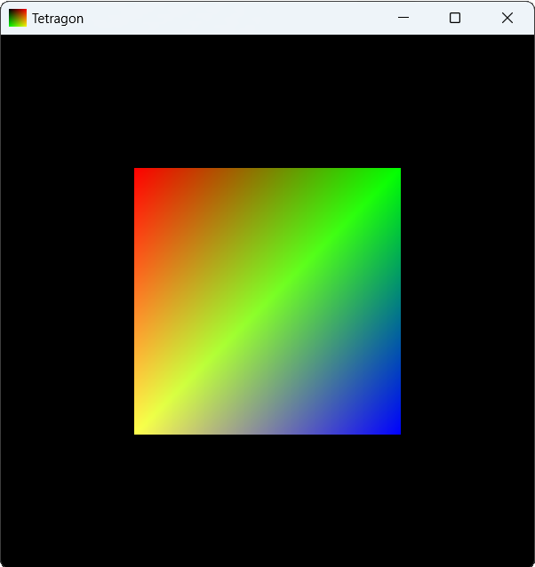
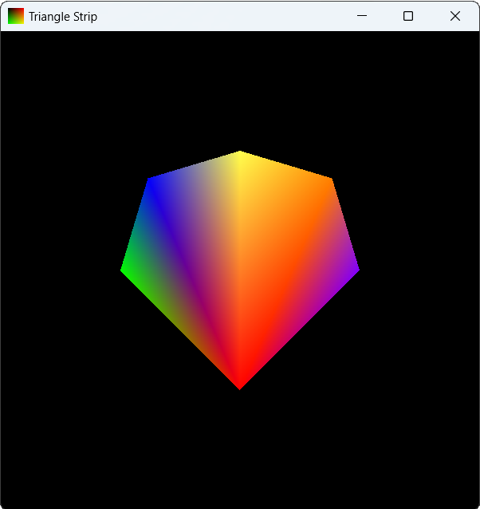
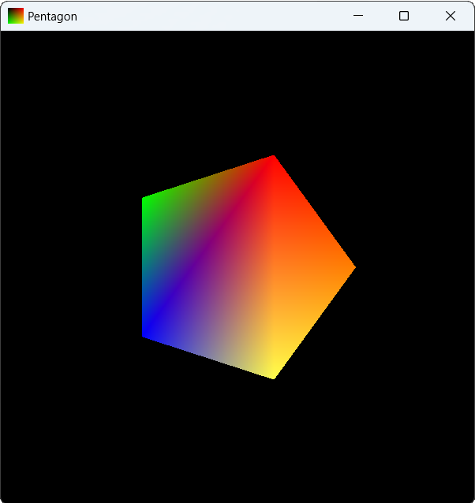

# Лабораторная работа № 11. Построение различные 2D фигур. Плоское закрашивание. Uniform
## Задание
1. Нарисовать четырехугольник, веер, правильный пятиугольник. Для этого меняете количество точек и параметр в `glDrawArrays(GL_TRIANGLES, 0, 3);`
2. Закрасить каждую из фигур плоским закрашиванием - цвет задать константой в шейдере.
3. Закрасить каждую из фигур плоским закрашиванием - цвет передать во  фрагментный шейдер через uniform-переменные из основной программы.

## Демонстрация работы

